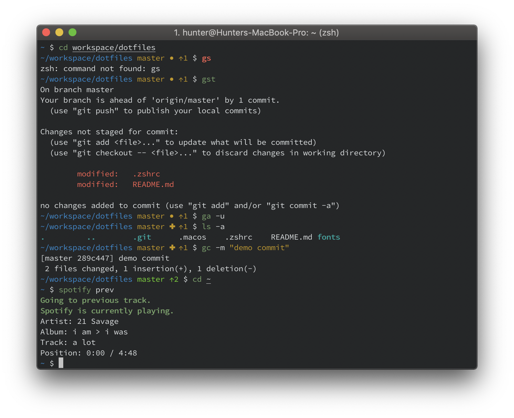
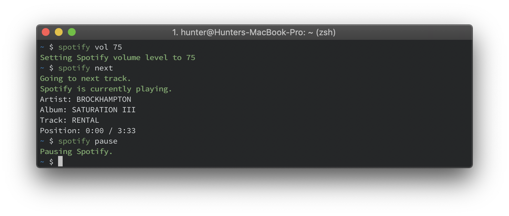
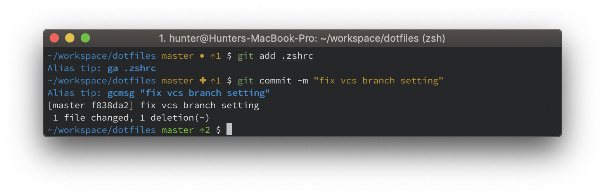

Before using this repo, I suggest making a fork of it so you can customize yourself. I also haven't tested these configs on any machine other than my own (MacBook Pro 2018, macOS Mojave 10.14.2 _as of December 24, 2018_).

# Zsh config
I'm using oh-my-zsh with my own take on the powerelevel9k theme. Installation guide coming soon.



## Plugins
Other than the git plugin, none of the plugins are essential to my workflow and are more _nice-to-haves_. 
```
plugins=(
    git
    osx
    web-search
    vscode
    zsh-syntax-highlighting
    alias-tips
)
```
#### [git](https://github.com/robbyrussell/oh-my-zsh/wiki/Plugin:git) - adds a bunch of helpful aliases for git-related things.
#### [osx](https://github.com/robbyrussell/oh-my-zsh/wiki/Plugins#osx) - I mostly just use it to control spotify from my command line.
If you want to query songs, artists, and playlists (rather than just access media controls) you'll have to [setup an application](https://developer.spotify.com/my-applications/#!/applications/create) and input your `CLIENT_ID` and `CLIENT_SECRET` into `${USER_CONFIG_FILE}`

#### [web-search](https://github.com/robbyrussell/oh-my-zsh/tree/master/plugins/web-search) - Let's you run a google search query from your command line. I use it lookup errors I generate.
#### [vscode](https://github.com/robbyrussell/oh-my-zsh/tree/master/plugins/vscode#vs-code) - some helpful aliases regarding Visual Studio Code
You have to install `code` command in PATH for the aliases to work: 
* In Visual Studio Code, access the Command Palette (__Command__+__Shift__+__P__)
* Search for "Shell" in the prompt
* Select "Shell Command: Install `code` command in PATH"
#### [zsh-syntax-highlighting](https://github.com/zsh-users/zsh-syntax-highlighting#zsh-syntax-highlighting-) - helps in reviewing commands and building confidence
This plugin's repo must be cloned into your oh my zsh plugins directory:
```
git clone https://github.com/zsh-users/zsh-syntax-highlighting.git ${ZSH_CUSTOM:-~/.oh-my-zsh/custom}/plugins/zsh-syntax-highlighting
```
#### [alias-tips](https://github.com/djui/alias-tips#alias-tips) adds an uninstrusive reminder whenever you execute a command that has an assigned alias.
This plugin's repo must be cloned into your oh my zsh plugins directory:
```
git clone https://github.com/djui/alias-tips.git ${ZSH_CUSTOM1:-$ZSH/custom}/plugins/alias-tips
```


## Mac OS
Truth be told, I haven't actually tested this full script yet (only bits and pieces). It's based on https://mths.be/macos, with a couple alterations (mostly removals).